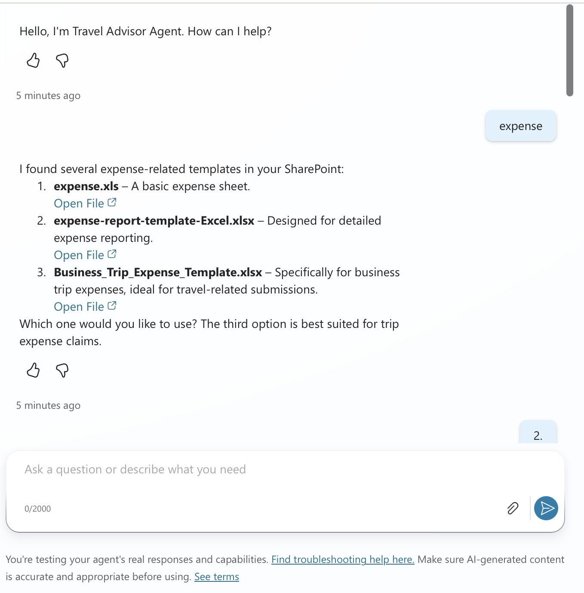
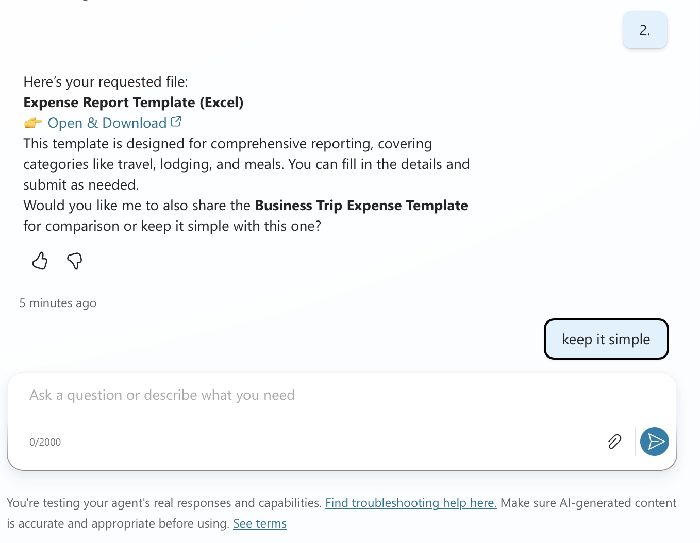
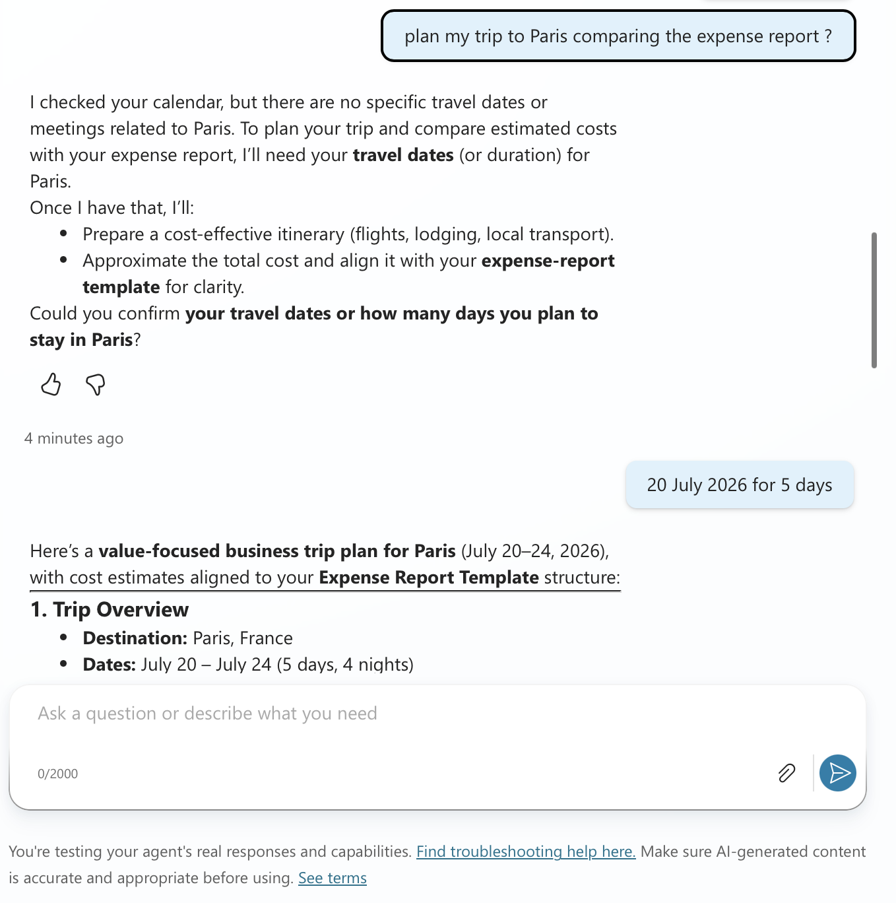
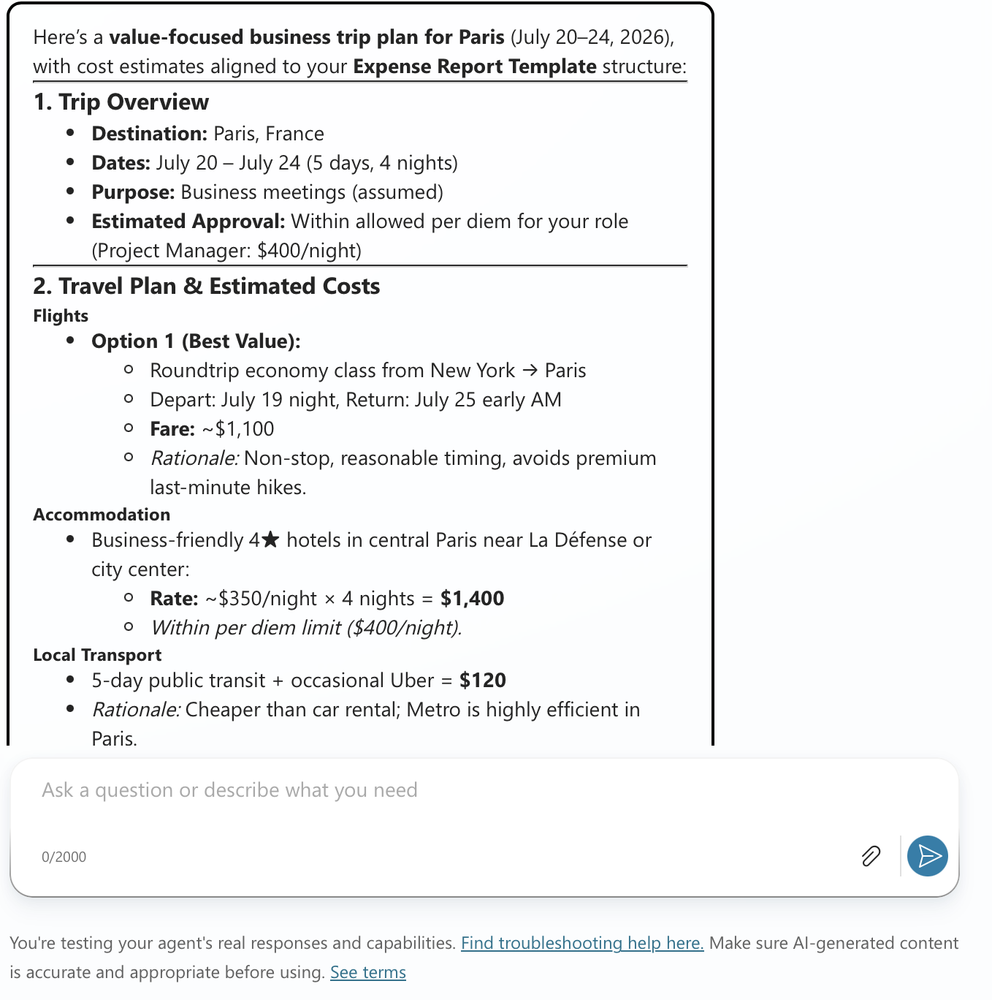
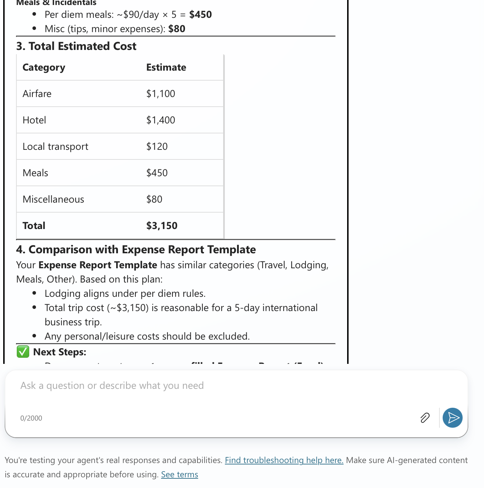
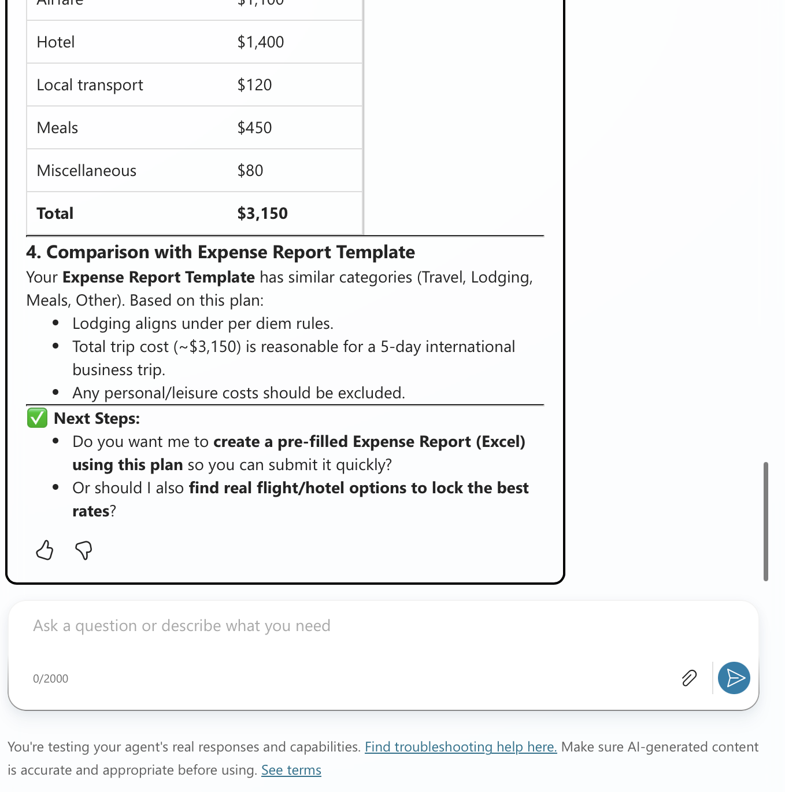

# Travel Advisor Agent
## This is an Enterprise Agent which plans Business for Employees.

|[Youtube - Demo](https://youtu.be/bLde8A3F2bQ)|

### Expense Template Prompt Images:
#### Travel Advisor Agent uses Work IQ SharePoint Get_Files Tool here.

An AI travel assistant built with Microsoft Copilot Studio that lives inside Microsoft 365 Copilot.  
It reads your work context via Work IQ and gives per-diem + policy-compliant trip plans without asking for dates or job title.

### What it does

**@Travel Advisor** in Teams or copilot.microsoft.com can:
1. **Auto-detect trip dates** from your Outlook calendar via Work IQ
2. **Apply per-diem rules** based on your job_title from Entra ID 
3. **Pull expense templates** from SharePoint
4. **Cite sources** like `[Work IQ: Calendar]` so you trust the answer

Example:  
`@Travel Advisor Plan my trip to Toronto next week`  
→ Returns dates, hotel budget, meals per-diem, and expense form link. No follow-up questions.
